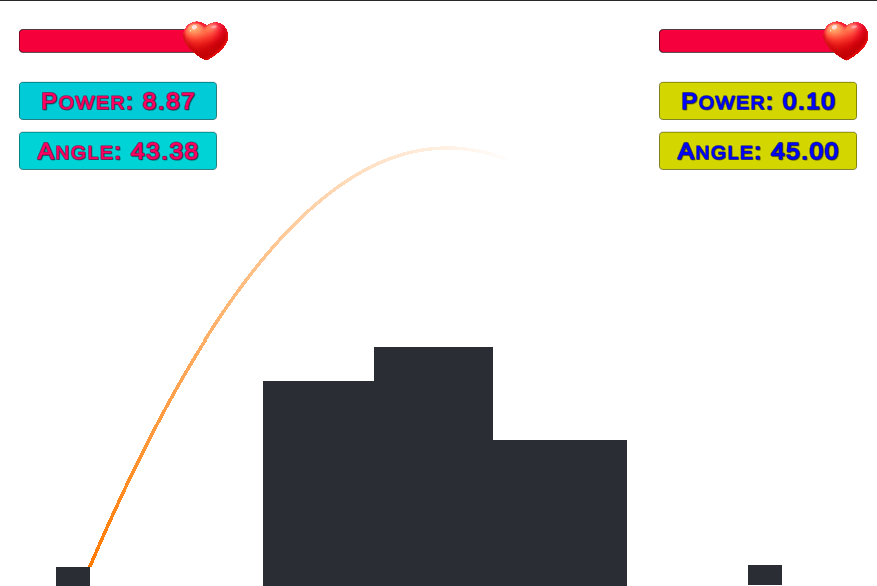
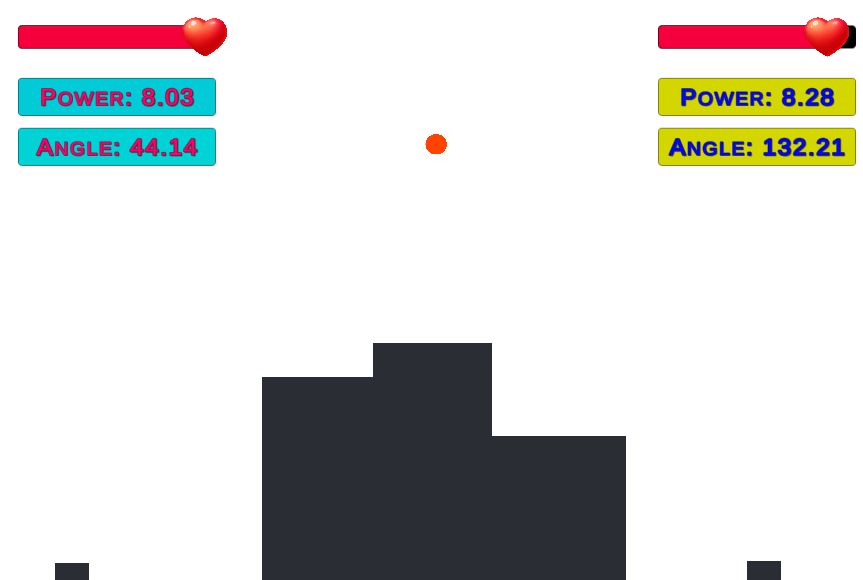
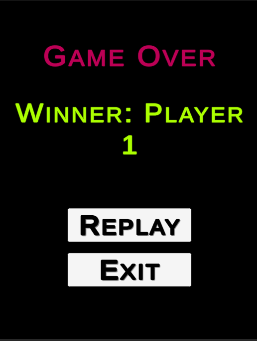

# Simple Tank Game

A Unity-based 2D tank game with turn-based mechanics, projectile physics, and UI elements.

## 🖼️ Screenshots

## 🎮 Features

- Turn-based gameplay
- Tank movement and aiming
- Projectile physics with trajectory prediction
- Collision detection and damage calculation
- Health, power, and angle UI elements
- Scene transitions (main menu, gameplay, game over)

## 🚀 Installation

1. Clone the repository to your local machine or download it as a zip file.
2. Open the project folder in Unity.
3. Open the `Scenes` folder and load the `MainMenu` scene.
4. Press the Play button in Unity to run the game.

## 🎮 Controls

- Draw the Aim by clicking on any point on the screen and move around to see the power and angle of the projectile to shoot
- Release the left mouse button to shoot the projectile
- Move left and right: Arrow keys or A/D
- Aim: Move the mouse
- Shoot: Left mouse button

## 📜 Scripts

- `GameManager`: Manages game state, player health, tanks, projectiles, and trajectory lines.
- `SceneTransitionManager`: Manages scene transitions, starting the game, and handling game over.
- `TankController`: Manages tank movement, updating angle and power, handling firing, and drawing trajectory lines.
- `ProjectileController`: Manages projectile movement along a curve, collision with tanks, and destruction.
- `TankUIController`: Manages UI elements for each tank, such as health, power, and angle.

## 📄 License

This project is licensed under the [MIT License](./LICENSE).
